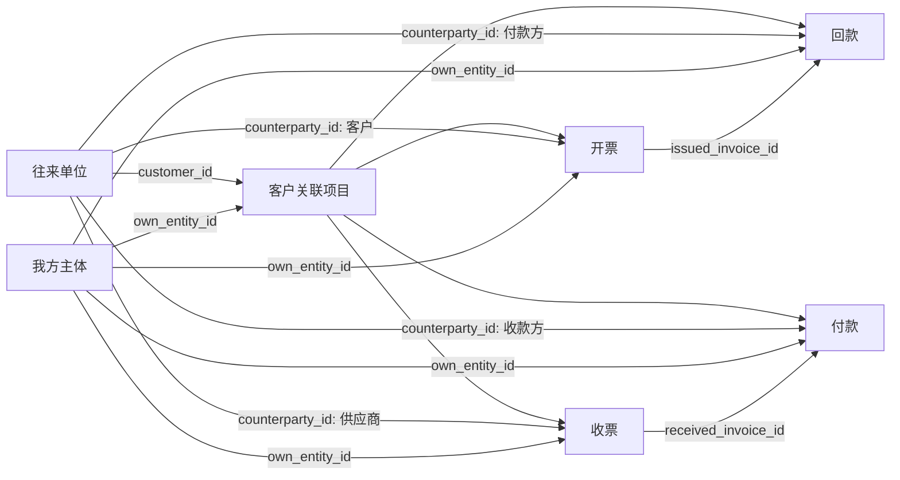

# 企业经营管理模块关系说明

## 目标

企业经营管理用于形成一个最小经营闭环：项目签约后，围绕同一个项目记录开票、收票、回款、付款，并能从往来单位、我方主体、项目三个视角反查数据和统计利润。

这套模块不负责工地实名制、班组、考勤和工资发放；那些仍属于项目管理模块。

## 主数据

### 往来单位

接口表：`enterprise_customers`

往来单位是统一的业务对象，不再强行区分“客户类型/供应商类型”。同一个单位可以在不同业务里承担不同角色：

- 客户关联项目里的签约客户
- 开票里的客户
- 收票里的供应商
- 回款里的付款方
- 付款里的收款方

代码里保留 `customer_*` 字段名是为了兼容历史迁移和前端旧接口，产品文案统一按“往来单位”展示。

### 我方主体

接口表：`enterprise_own_entities`

我方主体是我们自己的公司、分公司、项目公司或收付款主体。一个系统内可以维护 A、B、C 多个主体，后续每条项目和流水都能选择主体，用于统计“哪个主体开的票、收的钱、付的钱”。

## 业务模块

### 客户关联项目管理

接口表：`enterprise_projects`

项目是经营流水的承载对象。项目必须能关联：

- 往来单位：`customer_id`，用于客户视角查看项目和合同额。
- 我方主体：`own_entity_id`，用于主体视角统计项目和流水。
- 合同额：`contract_amount_cents`，用于经营看板和客户年度汇总。

### 开票管理

接口表：`enterprise_project_issued_invoices`

开票表示我们对外开出的发票，增加账面收入和应收。

关键关系：

- `project_id` 关联客户关联项目
- `counterparty_id` 关联往来单位，表示开票客户
- `own_entity_id` 关联我方主体，表示开票主体

### 收票管理

接口表：`enterprise_project_received_invoices`

收票表示供应商或分包单位给我们的票，增加账面成本和应付。

关键关系：

- `project_id` 关联客户关联项目
- `counterparty_id` 关联往来单位，表示供应商
- `own_entity_id` 关联我方主体，表示收票主体

### 回款管理

接口表：`enterprise_project_collections`

回款表示客户付款进入我方账户，增加现金收入，减少应收。

关键关系：

- `project_id` 关联客户关联项目
- `counterparty_id` 关联往来单位，表示付款方
- `own_entity_id` 关联我方主体，表示收款主体
- `issued_invoice_id` 可选关联开票记录

### 付款管理

接口表：`enterprise_project_payments`

付款表示我方向供应商、分包或其他往来单位支付款项，增加现金支出，减少应付。

关键关系：

- `project_id` 关联客户关联项目
- `counterparty_id` 关联往来单位，表示收款方
- `own_entity_id` 关联我方主体，表示付款主体
- `received_invoice_id` 可选关联收票记录

## 关系图

## 查询入口

- 往来单位管理：查看某个往来单位名下的项目、开票、收票、回款、付款和年度经营汇总。
- 我方主体管理：维护我方公司/主体基础信息，供项目和流水下拉搜索选择。
- 客户关联项目管理：查看项目合同额、经营看板、开票、收票、回款、付款。
- 开票/收票/回款/付款独立模块：按往来单位、项目、我方主体、状态、时间范围搜索经营流水。

列表页统一要求：

- 筛选区域放在表格上方。
- 涉及项目、往来单位、我方主体的输入使用数据库下拉搜索。
- 表格默认后端分页，默认每页 10 条。
- 导出使用后端按当前过滤条件导出所有数据，不只导出当前页。

## 计算方式

金额统一以分存储，页面展示时转换为元。

- 合同额 = `enterprise_projects.contract_amount_cents`
- 已开票 = 未作废开票金额合计
- 已收票 = 未作废收票金额合计
- 已回款 = 已确认回款金额合计
- 已付款 = 已确认付款金额合计
- 现金毛利 = 已回款 - 已付款
- 账面毛利 = 已开票 - 已收票
- 应收余额 = 已开票 - 已回款
- 应付余额 = 已收票 - 已付款
- 回款率 = 已回款 / 已开票
- 付款率 = 已付款 / 已收票

客户年度汇总按业务日期过滤：

- 开票/收票按发票日期
- 回款按回款日期
- 付款按付款日期

项目经营看板不按年份切分，汇总该项目全部有效流水。

## 数据一致性规则

- 记录保存 `counterparty_id` 和 `own_entity_id` 作为真实关系。
- 同时冗余保存往来单位名称和我方主体名称，方便列表展示和历史导出。
- 往来单位改名时，回写项目和四类流水里的冗余名称。
- 我方主体改名时，回写项目和四类流水里的冗余名称。
- 删除主数据采用软删除，不物理删除历史流水。
- 附件统一走系统已有上传能力，业务记录只保存附件数组。

## 当前验收闭环

一个正常经营业务应能完成：

1. 新增往来单位 A 和往来单位 B。
2. 新增我方主体 C。
3. 新增客户关联项目，选择 A 作为签约客户，选择 C 作为我方主体。
4. 在项目中新增开票，选择 A 和 C。
5. 在项目中新增收票，选择 B 和 C。
6. 在项目中新增回款，选择 A 和 C，可关联开票。
7. 在项目中新增付款，选择 B 和 C，可关联收票。
8. 从 A 的详情看到项目、开票、回款和对应汇总。
9. 从 B 的详情看到收票、付款和对应汇总。
10. 从项目详情看到开票、收票、回款、付款和利润计算。
11. 从独立四类流水模块按项目、往来单位、我方主体、状态、时间范围查到记录。
12. 改名往来单位或我方主体后，关联列表展示同步更新。
13. 删除某条流水后，列表和汇总不再计入该记录。

